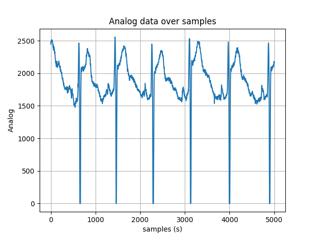
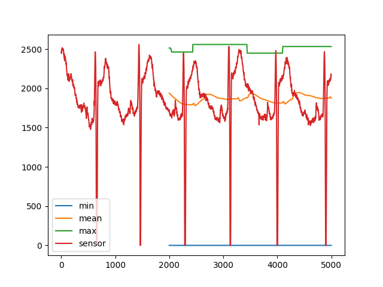
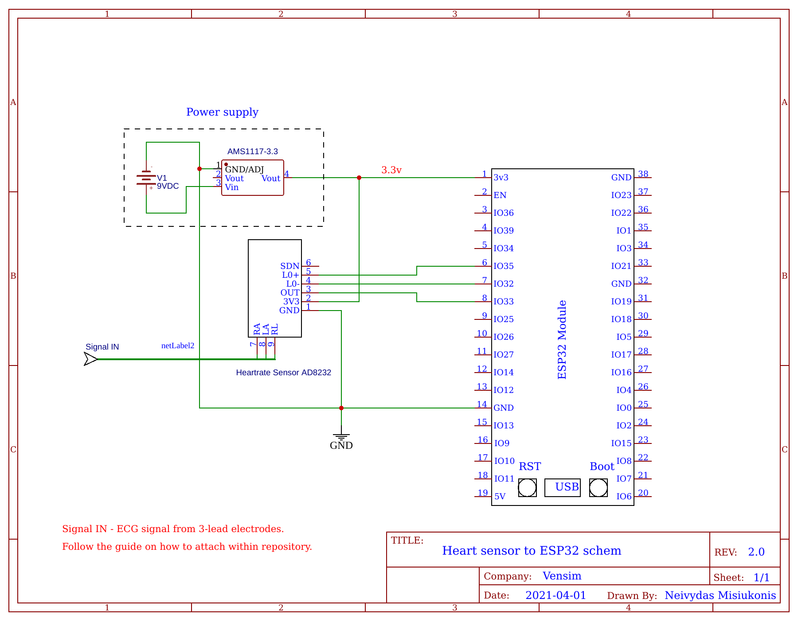

# Embedded_ML
Optional: 
Initialise virtual python env.
 
```bash
conda create -n EmbeddedML_env python=3.8.5
conda activate EmbeddedML_env
pip install requirements.txt
```

#TBD - Initialise system environment variables over a bash script.

Initialise data transmisison : 
```bash
ifconfig
```
Will output network interface configuration. Use the ip the python scripts will be run off.


In this case, the UDP server going to be run off is 192.168.0.19


Using Arduino IDE, edit the right values of WifiUDPClient.ino to connect to wifi and input own IP.


Install ESP32 arduino program 


Apply same changes in ECG_sample_get.py


Place ECG electrodes.
 Image from ConnectMed.com


Test the output of the ECG sensor in a serial monitor.
```bash
python UDP_init_test_mode.py
```

Gather sample data. Enable sampling server then initialise sampling.
```bash
python ECG_sampling_server.py
python UDP_init_sample_mode.py
```
Example output




With sampled data, perform feature extraction
```bash
python ECG_feature_extraction.py
python Visualise_ECG_features.py # Optional, to visualise the output.
```

Feature extraction example output.




To generate model with featured data 
```bash
python ECG_ML_Modelgen.py
```
This script will produce 2 files, ECG_model_quantized.tflite  and  ECG_ML_Model.h.

ECG_ML_Model.h to be used with Arduino IDE as header file.

Recompile the ESP32 with the new header file and activate Machine Learning mode
```bash
python UDP_init_ML_mode.py
```
Expected output


Library : EloquentTinyML


Example output. Predicting sine value with x input.


Heart sensor schematic.




